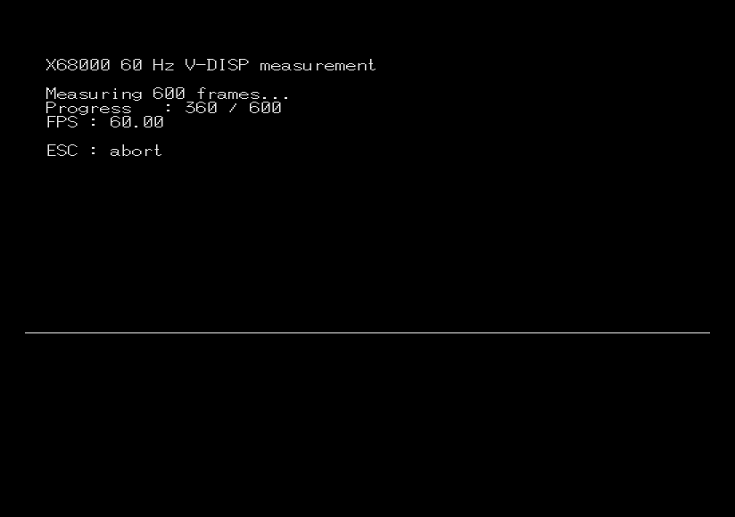

# crtc60hz

[English](README.md) | [日本語](README.ja.md)

<p align="center">
  
</p>

<p align="center">
  <strong><a href="https://uraraworks.github.io/WebX68k/?cpu=100&ram=12&hdd=https%3A%2F%2Fraw.githubusercontent.com%2Frenatus-novus-x%2Fcrtc60hz%2Frefs%2Fheads%2Fmain%2Fimages%2Fcrtc60hz.zip&run=1">▶ crtc60hz.zip を WebX68k ですぐ実行</a></strong>
</p>

X68000 / Human68k の31 kHzモードで525ライン、約60 Hzの垂直リフレッシュを
生成し、V-DISPとIOCS `_ONTIME`を使って実測するCプログラムです。

> [!NOTE]
> WebX68kではビルド済みディスクイメージを起動して動作を確認できますが、現状の
> CRTCおよびV-DISPタイミングは実測値の検証に十分な精度ではありません。周波数の
> 確認にはX68000実機、XEiJ、またはXM6 TypeGを使用してください。

## 動作内容

X68000の標準的な512 x 512 / 31 kHzモードは、約55.5 Hzで動作します。
このプログラムは最初にIOCS mode 12を設定し、垂直方向のCRTCレジスタだけを
変更して525ラインの周期を作ります。

```text
R04 = 0x020C  垂直総ライン数: 525ライン
R05 = 0x0001  VSYNC:             2ライン
R06 = 0x0022  表示開始:          34ライン目
R07 = 0x0202  表示終了:         514ライン目
```

内訳はVSYNC 2ライン、バックポーチ33ライン、表示480ライン、フロントポーチ
10ラインです。水平周波数を約31.5 kHzとすると、期待される垂直周波数は次の
ようになります。

```text
31500 / 525 = 60.0 Hz
```

## 計測方法

プログラムは次の処理を行います。

- `$E88001`にあるMC68901 MFP GPIPのbit 4からV-DISPを取得する
- 1フレームにつき1回、次のV-DISP変化まで待つ
- IOCS `_ONTIME`で正確に600フレーム分を計測する
- 浮動小数点を使わず、実測リフレッシュレートを計算する
- 計測中は軽量なFPS表示と1pxのフローラインを描画する

期待値は次のとおりです。

```text
525ライン設定: 600 V-DISPが約10.00秒 = 60.00 Hz
標準モード:    600 V-DISPが約10.82秒 = 55.5 Hz
```

## 安全性と画面状態の復元

画面タイミングを変更する前に、CRTC R04-R07と現在のIOCS CRT modeを保存します。
正常終了、ESCによる中止、V-DISP待ちのタイムアウトのいずれでも、保存したCRTC
レジスタと画面モードをHuman68kへ戻る前に復元します。

CRTCタイミングの変更により、ディスプレイが対応していない映像信号が出力される
可能性があります。X68000の31 kHzモードに対応していることが確認できた表示機器と
接続を使用し、実機での確認は自己責任で行ってください。

## ビルド

### 必要な環境

- X68000 / Human68k向け実行環境
- [elf2x68k](https://github.com/yunkya2/elf2x68k)
- GNU Make

### コンパイルとパッケージ作成

```sh
cd src
make
```

Makefileは`crtc60hz.x`をビルドし、起動可能なディスクイメージとWebX68k用ZIPを
作成します。生成される`.o`、`.elf`、`.x`、`.xdf`、`.hdf`、通常の`.zip`は
Gitの追跡対象外です。

## リポジトリ構成

```text
.
├── README.md
├── README.ja.md
├── images/
│   ├── teaser.png
│   ├── crtc60hz.zip
│   ├── crtc60hz_technical_guide_en.pdf
│   └── crtc60hz_technical_guide_ja.pdf
└── src/
    ├── Makefile
    └── crtc60hz.c
```

## 解説資料

- [Technical guide (English PDF)](images/crtc60hz_technical_guide_en.pdf)
- [技術解説資料（日本語 PDF）](images/crtc60hz_technical_guide_ja.pdf)

## 動作確認環境

約60 Hzでの動作と安全な画面復帰を、X68000実機、XEiJ、XM6 TypeGで確認して
います。WebX68kとMPX68Kでは、CRTCから求めたタイミング、V-DISP、ホスト側の
フレーム進行をより正確に連動させる必要があります。
